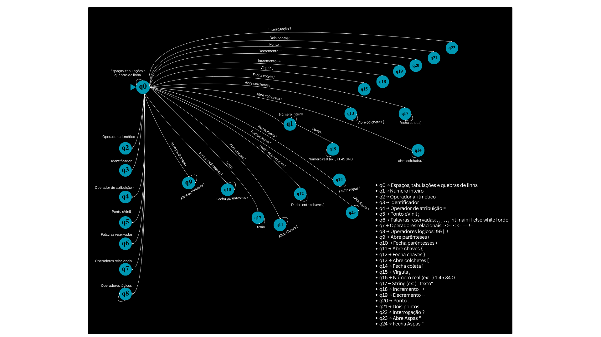

# Compilador Léxico em C++

Este repositório contém a implementação de um **compilador simples** desenvolvido em **C++**, focado na **Análise Léxica**.  
O projeto faz parte da disciplina de **Compiladores** e tem como objetivo reconhecer diferentes tokens em um código-fonte.

## 🎯 Objetivo

Implementar a análise léxica de um compilador, identificando tokens como identificadores, números, operadores, delimitadores e palavras reservadas.

## 🔧 Tecnologias Utilizadas

- C++ (g++)
- Git/GitHub (colaboração em equipe)

## 🧩 Estados e Tokens Reconhecidos

- **q0** → Espaços, tabulações e quebras de linha
- **q1** → Número inteiro
- **q2** → Operador aritmético
- **q3** → Identificador
- **q4** → Operador de atribuição `=`
- **q5** → Ponto e vírgula `;`
- **q6** → Palavras reservadas: `int`, `main`, `if`, `else`, `while`, `for`, `do`
- **q7** → Operadores relacionais: `> >= < <= == !=`
- **q8** → Operadores lógicos: `&& || !`
- **q9** → Abre parênteses `(`
- **q10** → Fecha parênteses `)`
- **q11** → Abre chaves `{`
- **q12** → Fecha chaves `}`
- **q13** → Abre colchetes `[`
- **q14** → Fecha colchetes `]`
- **q15** → Vírgula `,`
- **q16** → Número real (ex: `1.45`, `34.0`)
- **q17** → String (ex: `"texto"`)
- **q18** → Incremento `++`
- **q19** → Decremento `--`
- **q20** → Ponto `.`
- **q21** → Dois pontos `:`
- **q22** → Interrogação `?`
- **q23** → Abre Aspas '"'
- **q24** → Fecha Aspas '"'

## 🖼 Imagens do Projeto

**Diagrama geral do compilador:**  


**Lexer e análise léxica:**  


## ▶️ Como compilar e executar

1. Clone o repositório:

   ```bash
   git clone https://github.com/SEU_USUARIO/compilador-lexico-cpp
   cd compilador-lexico-cpp
   ```

2. Compile o projeto:

```bash
  g++ main.cpp -o analisador
```

3. Execute o analisador passando um arquivo de código::

```bash
 ./analisador teste.cpp
```

## 📌 Autores

Luan Camargo

Matheus Andrade

Leonardo Neto

            Santos campeão!
            O melhor time do mundo mostrou mais uma vez sua grandeza e paixão dentro de campo.
            Essa conquista é fruto de muita garra, união e amor pelo manto sagrado.
            x == y
